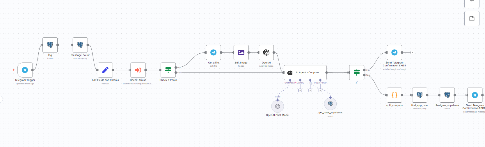

# 🎟️ Telegram Coupons AI Assistant
A self-hosted automation built with **n8n**, **OpenAI GPT-4o mini**, and **Supabase**, helping families manage coupons efficiently through a **Telegram bot**.

## 📌 Why?
Ever lost a discount coupon in a WhatsApp group image?

This project started when I realized my wife had collected valuable coupons from multiple consumer clubs (e.g., "Behatsdaa", "Haver", "Kranot") and shared them with me — but I forgot about them.

To solve this problem, I built an AI-powered Telegram assistant that stores, organizes, and makes these coupons searchable and reusable.

## 🛠️ Tech Stack
| Tool        | Purpose                                      |
|-------------|----------------------------------------------|
| n8n         | Workflow automation platform                 |
| OpenAI      | GPT-4o mini for parsing text/images          |
| Supabase    | PostgreSQL database in the cloud             |
| Docker      | Local hosting of the n8n server              |
| ngrok       | Exposing webhook to Telegram                 |
| Telegram    | Messaging interface with the bot             |
| Lovable     | Frontend UI for browsing and managing coupons|

## ⚙️ Features
- Accepts **text or image** messages via Telegram
- Uses **AI agent** to extract coupon data
- Stores coupons in **Supabase (PostgreSQL)**
- Prevents duplicate entries with validations
- Sends success/failure confirmation to the user
- Displays coupon database in an accessible UI app

## 🚀 Quick Start
### 1. Clone the repository
```bash
git clone https://github.com/<your-username>/n8n_coupons.git
cd n8n_coupons
```

### 2. Configure environment
Create a file named `.env` with your credentials.

> ✅ Tip: NEVER commit your real `.env`. Use `.env.example` for reference.

```env
# .env
N8N_BASIC_AUTH_USER=your_username
N8N_BASIC_AUTH_PASSWORD=your_password
N8N_HOST=0.0.0.0
N8N_PORT=5678
WEBHOOK_URL=https://<your-ngrok-url>
OPENAI_API_KEY=sk-...
SUPABASE_URL=https://...
SUPABASE_SERVICE_ROLE=...
```

You may also copy from `.env.example`:
```bash
cp .env.example .env
```

### 3. Start with Docker
```bash
docker-compose up -d
```

### 4. Start ngrok
Expose port 5678 to the public:
```bash
ngrok http 5678
```

Update the `.env` `WEBHOOK_URL` with the ngrok HTTPS address.

## 🧠 AI Agent Logic
- Prompts GPT-4o to identify: `code`, `description`, `expiration`, `category`
- Parses text or image content
- Formats into JSON
- Checks for existing coupons in DB
- Inserts new coupons only if not found

## 🖼️ Workflow Overview


## 📂 Repository Contents
```
📁 n8n_coupons/
├── docker-compose.yml
├── .env.example
├── workflow.json
├── README.md
├── n8n_workflow.png
└── .gitignore
```

## 🔐 Security Notes
- Do **not** push `.env` or `n8n_data` to GitHub.
- Use `.gitignore` to avoid uploading sensitive files.
- Consider adding encryption for database credentials and tokens.

## 🧪 Future Enhancements
- Add Telegram commands (e.g., `/search`, `/list`)
- Expiration reminders
- Tagging by source (Behatsdaa / Haver / etc.)
- Automatic backup

## 💰 Cost Estimate
> Running GPT-4o mini for this use case costs less than **$1/month**, thanks to minimal token usage.

## ✨ Final Thought
Built in a weekend, saved hours of hunting through chat threads.  
Now all family coupons are organized, searchable, and easy to use — in one place. 🫡
